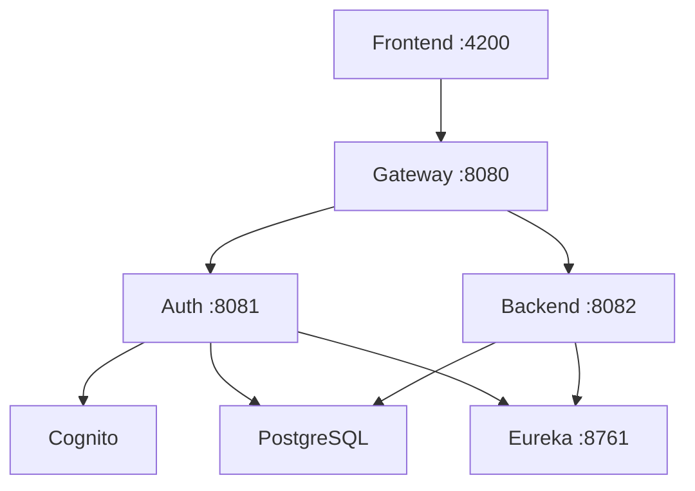

# 🔧 Configuration Reference

This document explains all configurable values and where to change them when spawning a new project.

---

## Quick Start: Spawning a New Project

```bash
# 1. Run the spawn script (handles most changes automatically)
./scripts/spawn-project.sh my-new-project ~/projects/my-new-project

# 2. Update Cognito callback URLs for your domain
#    Edit: terraform/terraform.tfvars (callback_urls, logout_urls)

# 3. Deploy infrastructure
cd terraform && terraform apply
```

---

## Central Configuration

**File:** [`project.config`](file:///Users/pawan.yadav/prototype/CloudInfraLite/project.config)

This is the **single source of truth** for project naming. The spawn script reads from here.

| Variable | Description | Example |
|----------|-------------|---------|
| `PROJECT_NAME` | Base project identifier | `cloud-infra` |
| `PROJECT_NAME_BUDGET` | Budget env project name | `cloud-infra-budget` |
| `DB_NAME` | PostgreSQL database name | `saas_db` |
| `JAVA_GROUP_ID` | Maven groupId | `com.learning` |

---

## File-by-File Configuration

### Terraform Files

| File | What to Change | Variable |
|------|----------------|----------|
| `terraform/terraform.tfvars` | Root project config | `project_name` |
| `terraform/envs/budget/terraform.tfvars` | Budget env config | `project_name` |
| `terraform/envs/production/terraform.tfvars` | Prod env config | `project_name` |

### SSM Parameter Paths

Pattern: `/${project_name}/${environment}/<parameter>`

Examples:
- `/cloud-infra/dev/database/url`
- `/cloud-infra-budget/budget/cognito/user_pool_id`

**Files that use SSM paths:**
- `application.yml` (all services)
- `terraform/envs/*/main.tf`

### Docker Configuration

| File | What Changes |
|------|--------------|
| `docker-compose.yml` | Container names, network name |
| `docker-compose.budget.yml` | Same as above |

### Maven/Java

| File | What to Change |
|------|----------------|
| `pom.xml` | `artifactId`, module names |
| `*/pom.xml` | Parent reference |

---

## AWS Resource Naming

All AWS resources follow this pattern:
```
${project_name}-${environment}-${resource_type}
```

Examples:
| Resource | Name |
|----------|------|
| VPC | `cloud-infra-budget-vpc` |
| RDS | `cloud-infra-budget-postgres` |
| User Pool | `cloud-infra-budget-user-pool` |
| S3 Bucket | `cloud-infra-budget-uploads` |
| Log Groups | `/ecs/cloud-infra-budget/service-name` |

---

## Debugging Guide

### Where to Find Logs

| Service | Local Logs | AWS Logs |
|---------|------------|----------|
| Gateway | `docker-compose logs gateway-service` | CloudWatch `/ecs/*/gateway-service` |
| Auth | `docker-compose logs auth-service` | CloudWatch `/ecs/*/auth-service` |
| Backend | `docker-compose logs backend-service` | CloudWatch `/ecs/*/backend-service` |
| Lambda | N/A | CloudWatch `/aws/lambda/*` |

### Common Debug Commands

```bash
# View all service logs (last 100 lines)
docker-compose logs --tail=100 -f

# Check specific service
docker-compose logs -f auth-service

# Check container health
docker-compose ps

# Check database connection
docker exec -it cloud-infra-lite-postgres-1 psql -U postgres -d saas_db -c "SELECT 1;"

# Check Eureka registrations
curl http://localhost:8761/eureka/apps

# Check service health
curl http://localhost:8080/actuator/health
```

### Error Resolution Quick Reference

| Error | Common Cause | Debug Steps |
|-------|--------------|-------------|
| `401 Unauthorized` | JWT issuer mismatch | Check `COGNITO_ISSUER_URI` in docker-compose vs application.yml |
| `500 Internal Server Error` | DB migration failed | Check `docker logs platform-service | grep -i flyway` |
| `Connection refused` | Service not started | Check `docker-compose ps` for unhealthy services |
| `TenantNotFoundException` | Tenant not provisioned | Check `SELECT * FROM tenant` in DB |
| `CORS error` | Gateway config | Check `application.yml` allowed origins |

### Service Dependencies



---

## Environment Variables

### Required for Local Development

| Variable | Source | Used By |
|----------|--------|---------|
| `COGNITO_USER_POOL_ID` | SSM or .env | auth-service, gateway |
| `COGNITO_CLIENT_ID` | SSM or .env | auth-service |
| `COGNITO_ISSUER_URI` | SSM or .env | gateway, auth-service |
| `DATABASE_URL` | docker-compose | all services |

### Required for AWS Deployment

| Variable | Source | Description |
|----------|--------|-------------|
| `AWS_ACCESS_KEY_ID` | Environment | Terraform auth |
| `AWS_SECRET_ACCESS_KEY` | Environment | Terraform auth |
| `TF_VAR_github_access_token` | Environment | Amplify deployment |

---

## Checklist: Spawning New Project

- [ ] Run `spawn-project.sh`
- [ ] Update `terraform.tfvars` callback URLs
- [ ] Update `project.config` if needed
- [ ] Run `terraform init && terraform plan`
- [ ] Deploy: `terraform apply`
- [ ] Test signup flow
- [ ] Update DNS/domain settings
