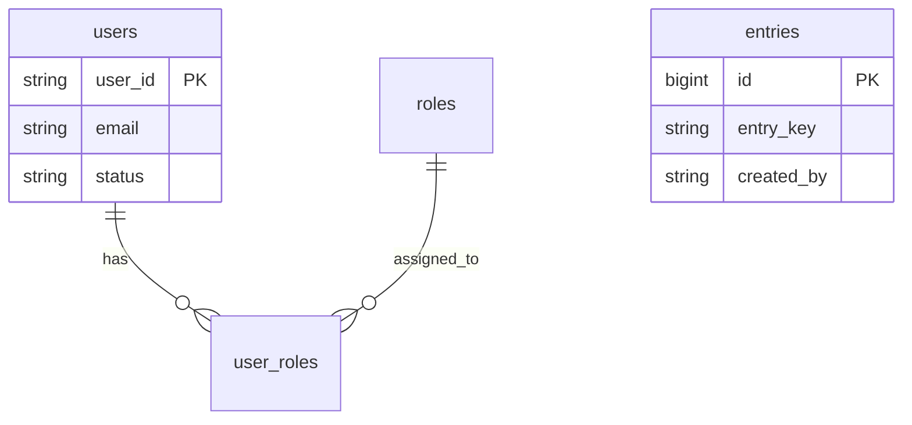

# Database Schema (Lite)

## Overview
The application uses a **Shared Database** pattern with a **Multi-Tenant** relational model using discriminator columns (`tenant_id`).

| Service | Database | Description |
|---------|----------|-------------|
| **Auth Service** | `cloud-infra-lite` (schema: `public`) | User identities, roles, and permissions (if persisting locally) |
| **Backend Service** | `backend_db` (or shared `cloud-infra-lite`) | Business data (Entries) |

> **Note:** For the "Lite" template, both services typically share the same PostgreSQL instance and can share the same database (`cloud-infra-lite`) for simplicity, but strictly separate tables.

## 1. Auth Service Schema
Handles user identity metadata and role assignments.

### `users`
Local registry of users (synced from/linked to Cognito).

| Column | Type | Description |
|--------|------|-------------|
| `user_id` | VARCHAR(255) | **PK** - Cognito User ID (Sub) |
| `tenant_id` | VARCHAR(64) | **Discriminator** (Default: 'default') |
| `email` | VARCHAR(255) | User Email |
| `name` | VARCHAR(255) | Display Name |
| `status` | VARCHAR(32) | `ACTIVE`, `DISABLED` |
| `created_at` | TIMESTAMPTZ | Creation timestamp |

### `roles`
Predefined roles for the system.

| Column | Type | Description |
|--------|------|-------------|
| `id` | VARCHAR(64) | **PK** - `admin`, `editor`, `viewer` |
| `tenant_id` | VARCHAR(64) | **Discriminator** |
| `name` | VARCHAR(100) | Display name |

### `user_roles`
Maps users to roles.

| Column | Type | Description |
|--------|------|-------------|
| `id` | BIGSERIAL | **PK** |
| `tenant_id` | VARCHAR(64) | **Discriminator** |
| `user_id` | VARCHAR(255) | FK -> users.user_id |
| `role_id` | VARCHAR(64) | FK -> roles.id |

---

## 2. Backend Service Schema
Stores business domain data.

### `entries`
A sample resource entity.

| Column | Type | Description |
|--------|------|-------------|
| `id` | BIGSERIAL | **PK** |
| `tenant_id` | VARCHAR(64) | **Discriminator** |
| `entry_key` | VARCHAR(255) | Unique key |
| `entry_value` | TEXT | Value content |
| `created_by` | VARCHAR(255) | User ID who created it |
| `created_at` | TIMESTAMPTZ | Creation timestamp |
| `updated_at` | TIMESTAMPTZ | Last update timestamp |

## Entity Relationship Diagram

