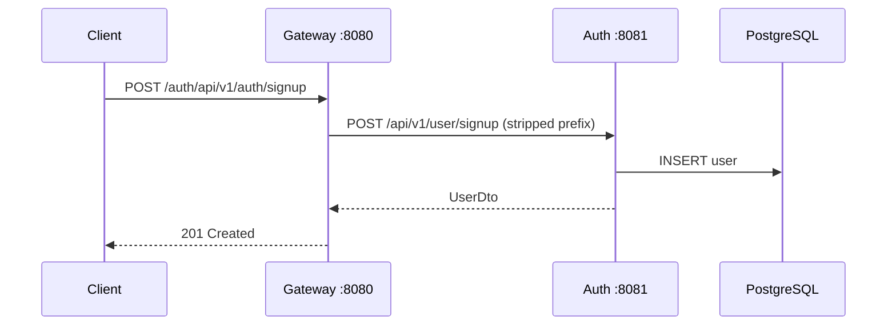

# 🔍 Debugging Guide

Fast-track your debugging with this comprehensive reference.

---

## 1. Log Locations

### Local Development

```bash
# All services (live tail)
docker-compose logs -f

# Specific service
docker-compose logs -f auth-service

# Last 100 lines
docker-compose logs --tail=100 gateway-service

# Filter for errors
docker-compose logs auth-service 2>&1 | grep -i error
```

### AWS Budget Environment

```bash
# SSH into EC2
ssh -i ~/.ssh/your-key.pem ec2-user@<EC2_PUBLIC_IP>

# View Docker logs
cd /opt/app
docker-compose -f docker-compose.budget.yml logs -f

# View specific service
docker-compose -f docker-compose.budget.yml logs auth-service
```

### AWS Production (ECS)

```bash
# Use AWS CLI
aws logs tail /ecs/cloud-infra-prod/gateway-service --follow

# Or CloudWatch Console
# Navigate to: CloudWatch → Log Groups → /ecs/cloud-infra-prod/*
```

---

## 2. Health Checks

### Service Health

```bash
# Gateway (main entry point)
curl http://localhost:8080/actuator/health

# Individual services
curl http://localhost:8081/actuator/health  # auth-service
curl http://localhost:8082/actuator/health  # backend-service
curl http://localhost:8761/actuator/health  # eureka-server
```

### Database Health

```bash
# Connect to PostgreSQL
docker exec -it cloud-infra-lite-postgres-1 psql -U postgres -d saas_db

# Quick table check
\dt

# Check users
SELECT user_id, email, status FROM users LIMIT 5;

# Check roles
SELECT id, name FROM roles;

# Check migrations
SELECT * FROM flyway_schema_history_auth ORDER BY installed_on DESC LIMIT 5;
```

### Eureka (Service Discovery)

```bash
# XML format
curl http://localhost:8761/eureka/apps

# Check specific service
curl http://localhost:8761/eureka/apps/AUTH-SERVICE
```

---

## 3. Common Errors & Solutions

### Authentication Errors

| Error | Symptom | Root Cause | Solution |
|-------|---------|------------|----------|
| `401 Unauthorized` | All API calls fail after login | JWT issuer mismatch | Check `COGNITO_ISSUER_URI` matches in docker-compose AND application.yml |
| `InsufficientAuthenticationException` | Login succeeds but dashboard fails | Gateway not validating JWT correctly | Verify environment variable name: `COGNITO_ISSUER_URI` (not `OAUTH2_ISSUER_URI`) |
| `Invalid token` | Random token failures | Clock skew between containers | Restart Docker, ensure system clock is synced |

**Debug JWT issues:**
```bash
# Decode a JWT token (paste token at jwt.io or use jq)
echo "YOUR_TOKEN" | cut -d'.' -f2 | base64 -d | jq

# Check the 'iss' (issuer) field matches your Cognito pool
```

### Database Errors

| Error | Symptom | Root Cause | Solution |
|-------|---------|------------|----------|
| `relation does not exist` | Table not found | Flyway migration didn't run | Check migration status, trigger manually if needed |
| `DataTruncation` | Insert fails | Column too small | Check Flyway script vs actual column size |
| `Connection refused` | Can't connect | PostgreSQL not started | Check `docker-compose ps postgres` |
| `MIGRATION_ERROR` | Tenant stuck | Migration timeout | Increase timeout in `HttpClientFactory.java` (now 60s) |

**Debug database issues:**
```bash
# Check Flyway history
docker exec -it cloud-infra-lite-postgres-1 psql -U postgres -d saas_db -c \
  "SELECT version, description, success FROM flyway_schema_history ORDER BY installed_on DESC LIMIT 10;"

# Check if tenant schema exists
docker exec -it cloud-infra-lite-postgres-1 psql -U postgres -d saas_db -c \
  "SELECT schema_name FROM information_schema.schemata WHERE schema_name LIKE 'tenant_%';"
```


### Lambda Errors (Pre-Token Generation)

| Error | Symptom | Root Cause | Solution |
|-------|---------|------------|----------|
| `Task timed out` | Login hangs | Lambda can't reach auth-service | Check VPC config, security groups |
| `Connection refused` | Login fails | Wrong auth-service URL | Check Lambda env vars |
| Wrong role/tenant | User gets viewer instead of admin | `_detect_idp_type` returning wrong value | Check Lambda uses 'COGNITO' for native users |

**Debug Lambda:**
```bash
# View Lambda logs
aws logs tail /aws/lambda/cloud-infra-budget-pre-token-generation --follow

# Test Lambda locally (if you have SAM)
sam local invoke PreTokenGenerationFunction -e event.json
```

---

## 4. Request Tracing

### Correlation IDs

All requests include a `X-Correlation-Id` header. Use it to trace across services:

```bash
# Make request with custom correlation ID
curl -H "X-Correlation-Id: debug-123" http://localhost:8080/auth/api/v1/auth/me

# Search logs for that ID
docker-compose logs 2>&1 | grep "debug-123"
```

### Gateway to Service Trace



---

## 5. Performance Debugging

### Slow Requests

```bash
# Check response times
time curl http://localhost:8080/auth/api/v1/auth/me -H "Authorization: Bearer $TOKEN"

# Check container resource usage
docker stats

# Check database slow queries
docker exec -it cloud-infra-lite-postgres-1 psql -U postgres -d saas_db -c \
  "SELECT query, calls, mean_time FROM pg_stat_statements ORDER BY mean_time DESC LIMIT 10;"
```

### Memory Issues

```bash
# Check JVM memory
docker exec gateway-service jcmd 1 VM.native_memory summary

# Force garbage collection (for testing)
docker exec gateway-service jcmd 1 GC.run
```

---

## 6. Quick Fixes

### Reset Everything (Nuclear Option)

```bash
docker-compose down -v
docker volume prune -f
docker-compose up -d
```

### Restart Single Service

```bash
docker-compose restart auth-service
```

### Rebuild Single Service

```bash
./mvnw clean package -pl auth-service -am -DskipTests
docker-compose up -d --build auth-service
```

### Clear Tenant (For Testing)

```bash
docker exec -it cloud-infra-lite-postgres-1 psql -U postgres -d saas_db -c \
  "DELETE FROM user_tenant_memberships WHERE tenant_id = 'test-tenant';
   DELETE FROM tenant WHERE id = 'test-tenant';"
```
